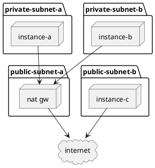

# Terraform and AWS training

## Pre-requisites

1. Add `AWS - Beach` Okta Chiclet
2. Install [AWS CLI](https://docs.aws.amazon.com/cli/latest/userguide/install-cliv2.html)
3. Install [AWS CLI Session Manager Plugin](https://docs.aws.amazon.com/systems-manager/latest/userguide/session-manager-working-with-install-plugin.html)
4. Install [SAML2AWS](https://github.com/Versent/saml2aws#install)
5. Install [Terraform](https://www.terraform.io/downloads.html)

## Configure CLI access to AWS

We're going to use the `saml2aws` application to authenticate to AWS using our Okta credentials. The following snippet will configure `saml2aws` to use Okta verify for multi-factor authentication. If you use Google Authenticator then replace `--mfa OKTA` with `--mfa TOTP`.

This is a one-time setup.

```sh
OKTA_USER=<you>@thoughtworks.com
saml2aws configure \
          --idp-account tw-beach \
          --idp-provider Okta \
          --mfa OKTA \
          --username ${OKTA_USER}\
          --url https://thoughtworks.okta.com/home/amazon_aws/0oa1c9mun8aIqVj7I0h8/272 \
          --skip-prompt
```

## Login to AWS

Having setup `saml2aws` we can now use it to authenticate. We're going to login by providing our Okta password and MFA token and then set environment variables that the AWS CLI will use for authentication. Finally we're going to verify that everything has worked. The result of calling `aws sts get-caller-identity` should be some JSON identifying your UserId, Account and Arn.

```sh
OKTA_USER=<you>@thoughtworks.com
saml2aws login \
    --idp-account tw-beach \
    --profile default \
    --region eu-west-1 \
    --username ${OKTA_USER}
eval $(saml2aws script -a tw-beach)
aws sts get-caller-identity
```

This will provide us with credentials that we can use for 1h. We will need to re-run the following script to get a new token before this occurs:

```sh
saml2aws login -a tw-beach
eval $(saml2aws script -a tw-beach)
```

## Introduction to Terraform

Terraform is a tool for declaratively defining infrastructure resources. Terraform is cloud-agnostic: you can provision resources for AWS, GCP, Azure, Alibaba, Digital Ocean and many others as well as manage many other types of resource.

### Project outline

In this example we define a minimal project with a typical structure.

```sh
cd work
cp ../01-outline/* .
terraform init
terraform apply
cat terraform.tfstate
```

### Add AWS Provider

Terraform uses plugins to define the different types of resources it can manage. It calls these plugins *providers*. The list of providers can be found on the [Terraform Registry](https://registry.terraform.io). We're going to use the [AWS Provider](https://registry.terraform.io/providers/hashicorp/aws/latest).

In this example, we use the `aws_caller_identity` data source to retrieve our authentication details (just like calling `aws sts get-caller-identity`).

```sh
cp ../02-aws-provider/* .
terraform init
terraform apply
cat terraform.tfstate
``` 

## Introduction to AWS

AWS has data-centres in many parts of the world. Each of the parts of the world is known as a **region**. Regions have names such as `eu-west-1` or `us-east-2`. Each region has multiple physical independent data centres with super-high bandwidth/low latency connections between them. Each physical data-centre in a region is known as an **availability zone** (AZ). Availability zones are identified by a single character appended to the region, e.g. `eu-west-1a` and `eu-west-1b`.

Computer infrastructure comes down to 3 types of resource (and combinations of those):
* Compute
* Storage
* Networking

### VPC

For any provisioned (i.e. not serverless) resources we need a network to connect them to. AWS provides a resource known as a **Virtual Private Cloud** (VPC) that allows us to create our own private network for connecting our resources.

Each resource that we connect to the network requires one or more IP addresses. We need to make sure we provision a network that's big enough for all the things we might want to provision. If we aren't going to connect our private network to any other private networks (through mechanisms like peering and direct connect) then we can make it as big as we like.

The size of the network (and the set of IP addresses it will use) are defined using CIDR notation. The IP specified is the first IP of the block to use and the size of the block is specified after the slash. A smaller number after the slash the bigger the network.

The IP addresses must come from one of the private ranges:
* [10.0.0.0/8](https://www.calculator.net/ip-subnet-calculator.html?cclass=any&csubnet=8&cip=10.0.0.0&ctype=ipv4&printit=0&x=61&y=28)
* [172.16.0.0/12](https://www.calculator.net/ip-subnet-calculator.html?cclass=any&csubnet=12&cip=172.16.0.0&ctype=ipv4&printit=0&x=43&y=20)
* [192.168.0.0/16](https://www.calculator.net/ip-subnet-calculator.html?cclass=any&csubnet=16&cip=192.168.0.0&ctype=ipv4&printit=0&x=15&y=17)

```sh
cp ../03-aws-vpc/* .
terraform apply
cat terraform.tfstate
```

You can destroy the infrastructure you've created by using:

```sh
terraform destroy
```

### **EXERCISE**

No resources are ever provisioned directly into a VPC. Instead, resources are provisioned into a **subnet**. Subnets provide a way of splitting the VPC into smaller pieces.

Provision two [`aws_subnet`](https://registry.terraform.io/providers/hashicorp/aws/latest/docs/resources/subnet) resources within our VPC. Associate each of the subnets with a different availability zone.

N.B. you can use the [subnet calculator](https://www.calculator.net/ip-subnet-calculator.html) to help work out the CIDR blocks for these subnets. 

### Looping and conditionals

Terraform provides facilities for doing basic looping. A resource can have a `count` attribute. Terraform will create `count` instances of the resource. The current index is available via `count.index`.

A `locals` block introduces local variables. Local variables are referenced as `local.<var-name>`. Local variables can only be set from within the code.

Terraform [expressions](https://www.terraform.io/docs/language/expressions/index.html) and [functions](https://www.terraform.io/docs/language/functions/index.html) can be used do add imperitive logic to Terraform scripts: but these should be used with caution. The example here is a good example of why that caution is required!

Try different values of the `az_count` and `include_db` variables to see their effect.

```sh
cp ../05-looping/* .
terraform plan -var=owner=<initials> -var=region=eu-west-1 -var=vpc_cidr=10.0.0.0/16
```

Variables can also be set as environment variables:

```sh
export TF_VAR_owner=<initials>
export TF_VAR_region=eu-west-1
export TF_VAR_vpc_cidr=10.0.0.0/16
terraform plan
```

### Creating an Instance

In this next example, we want to create a virtual machine (an [`aws_instance`](https://registry.terraform.io/providers/hashicorp/aws/latest/docs/resources/instance)) that we can connect to with a shell. 

Our VPC is not connected to the Internet so we can't SSH onto the host. We're going to use an AWS feature called *Systems Manager Session Manager* to connect to our host.

We now have a lot more to contend with as to make this happen our virtual machine needs to call AWS API's to interact with the AWS service - and we need to call these API's without an Internet connection. To enable us to call these API's we're going to use a feature called *VPC Interface Endpoints* ([`aws_vpc_endpoint`](https://registry.terraform.io/providers/hashicorp/aws/latest/docs/resources/vpc_endploint)). These provision *Elastic Network Interfaces* (ENIs) into our subnets that can receive the API requests and transmit them over the AWS network to the AWS services. We need the DNS entries for these services to point at our ENIs - so we need to enable DNS support on our VPC.

In our terraform code we're using the "splat" operator to reference a set of attributes from a resource we created where the `count` attribute was set.

The *VPC Interface Endpoints* require us to setup a *Security Group* ([`aws_security_group`](https://registry.terraform.io/providers/hashicorp/aws/latest/docs/resources/security_group)) to govern which traffic the endpoint can receive. A *Security Group* is a kind of Firewall.

When we create an instance we define the base image that will be used to provision it. These are called *Amazon Machine Images* (AMIs). We're going to look up the latest Ubuntu release from Canonical.

Instance types define how much CPU, memory, network capacity and ephemeral disk our instance will have.

As our instance will need to call AWS APIs to support session manager: it will need permissions to allow this. The AWS API authentication/authorization system is called *Identity and Access Management* (IAM). Our instance will also need a security group that let it send the AWS API requests.

```sh
cp ../06-aws-instance/* .
terraform apply
INSTANCE_ID=$(aws ec2 describe-instances --query 'Reservations[*].Instances[?State.Name==`running` && Tags[?Key==`Name` && Value==`<your-initials>-instance`]].InstanceId[]' --output text)
aws ssm start-session --target "${INSTANCE_ID}"
```

### **EXERCISE**

AWS has a concept of an *Auto Scaling Group* (ASG). An ASG enables us to provision a group of hosts and will ensure that the number of hosts always corresponds to the desired capacity. It can also be configured to automatically update the desired capacity based on various metrics.

Replace our [`aws_instance`](https://registry.terraform.io/providers/hashicorp/aws/latest/docs/resources/instance) with an [`aws_auto_scaling_group`](https://registry.terraform.io/providers/hashicorp/aws/latest/docs/resources/auto_scaling_group) that has a minimum capacity of 1 instance and a maximum capacity of 2 instances. When scaled up - the instances should be distributed across our subnets.

You can scale it up using the AWS CLI (assuming you named your ASG <your-initials>-instance-group):

```sh
aws autoscaling set-desired-capacity --auto-scaling-group-name <your-initials>-instance-group --desired-capacity 2
```

### Internet Access

Up until this point, our VPC has been entirely disconnected from the Internet. We've been able to access our instance using AWS services but our instance has been unable to reach the Internet.

In this example, we add Internet access to our VPC. To allow a VPC to connect to the Internet we need to provision an Internet Gateway ([`aws_vpc_internet_gateway`](https://registry.terraform.io/providers/hashicorp/aws/latest/docs/resources/vpc_internet_gateway)). However, our instance doesn't have a public IP address so we need to also provision a NAT Gateway ([`aws_vpc_nat_gateway`](https://registry.terraform.io/providers/hashicorp/aws/latest/docs/resources/vpc_nat_gateway)) and have traffic from our private subnets route to the NAT gateway - which runs in our public subnets and does have a public IP address) and have traffic from our public subnets (including the NAT Gateway) route to the Internet gateway.



We no longer require our VPC Interface Endpoints to reach the AWS API's as we can now reach them over the Internet.

```sh
cp ../08-internet-access/* .
terraform apply
INSTANCE_ID=$(aws ec2 describe-instances --query 'Reservations[*].Instances[?State.Name==`running` && Tags[?Key==`Name` && Value==`<your-initials>-instance-group`]].InstanceId[]' --output text)
aws ssm start-session --target "${INSTANCE_ID}"
```

### Provisioning

We've got a host that can connect to - but its not doing anything useful. We need to provision some software onto a host to provide some value.

We can use [cloud-init](https://cloud-init.io/) to configure and provision software onto a host. We provide the cloud-init configuration to the AWS instances via the `user_data` or `user_data_base64` attributes of `aws_instance`, `aws_launch_template` and `aws_launch_configuration`.

We going to provision a host that runs NGINX and that can be reached from the Internet.

```sh
cp ../09-provisioning/* .
terraform apply
NGINX=$(aws ec2 describe-instances --query 'Reservations[*].Instances[?State.Name==`running` && Tags[?Key==`Name` && Value==`<your-initials>-instance-group`]].PublicDnsName[]' --output text)
curl http://$NGINX
```

### **EXERCISE**

Currently we have to go and find the IP address of our NGINX instance using the AWS API. This doesn't work if we have >1 instance in our auto-scaling group and this value can change as the auto-scaling group expands or contracts or if the instance is replaced.

Add a classic load-balancer [`aws_elb`](https://registry.terraform.io/providers/hashicorp/aws/latest/docs/resources/elb) to front our auto-scaling group. Add a DNS entry of `<your-initials>.daleaws.co.uk` that points to the load-balancer ([`aws_route53_record`](https://registry.terraform.io/providers/hashicorp/aws/latest/docs/resources/route53_record) using an `alias`).

### Cleanup

Now clean everything up:

```sh
terraform destroy
```